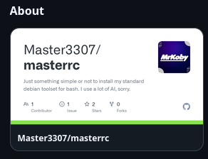

<h1 align="center">GitHub Repo Card In About Sidebar</h1>

Adds the repository's Open Graph social-preview image directly below the About heading.

  

<strong>📄・Description</strong>

This UserScript displays the Social Preview that you see on sites for example Discord below the link of the Repo.

The two examples above show what it would look like in the About section of any Repository for example.

<strong>🔗・Links</strong>
- [Install (Raw)](https://github.com/Master3307/GitHubRepoCardInAboutSidebar/raw/refs/heads/master/githubrepocardinaboutsidebar.user.js)
- [Greasy Fork](https://greasyfork.org/en/scripts/590854-github-social-preview-card-in-about-sidebar)
- [OpenUserJS](https://openuserjs.org/scripts/MrKoby07/GitHub_Social_Preview_Card_in_About_Sidebar)

<strong>📦・Related</strong>
- [GitHub Readme On Top Of Files](https://github.com/Master3307/GitHubReadmeOnTopOfFiles)
